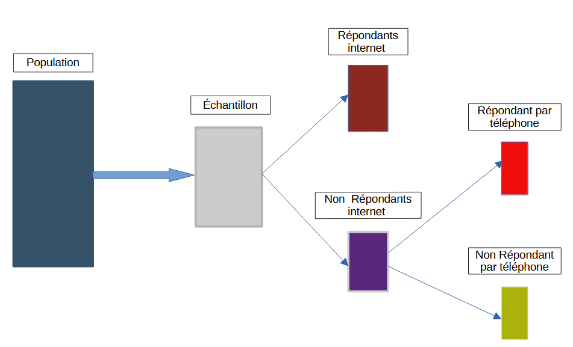

```{r setup, include=FALSE}
knitr::opts_chunk$set(echo = TRUE)

rm(list = ls())

if (!requireNamespace("pacman", quietly = TRUE)) install.packages("pacman")

pacman::p_load(tibble, DT, tidyverse, tidymodels, skimr, rsample, kernlab, ggplot2, readr,
               gtsummary,MASS,simstudy, dplyr,Matrix)

# install.packages("xfun")
# update.packages(ask = FALSE) # Mise à jour des packages R
# install.packages("xfun", dependencies = TRUE)
# utils::install.packages(c("tinytex", "rmarkdown"))
# utils::contrib.url(repos, "source")
```

\newpage
# Introduction

Le processus de réalisation d’une enquête repose sur plusieurs étapes essentielles, telles que la formulation de la problématique, la conception des questionnaires, la mise en œuvre de la collecte des données et leur suivi. Chacune de ces phases peut générer des erreurs en l'absence d'une méthode rigoureuse. L'ensemble de ces erreurs constitue l'erreur totale de l'enquête.

Certaines erreurs proviennent de l'administration du questionnaire, c'est-à-dire des difficultés liées aux différents modes de collecte des données. Ce problème se manifeste particulièrement dans les enquêtes multimodes, qui combinent divers supports (Internet, téléphone, face-à-face, papier) afin d'optimiser le taux de réponse tout en maîtrisant les coûts.

Le développement rapide des technologies numériques a favorisé l'émergence des enquêtes multimodes, transformant ainsi les méthodes de collecte de données. L'utilisation simultanée de plusieurs modes permet de mieux répondre aux besoins d'une population de plus en plus diversifiée, tout en soulevant d'importants défis méthodologiques. Par exemple, le protocole séquentiel, souvent utilisé, propose d'abord un mode de collecte (généralement Internet), suivi d'un mode complémentaire (téléphone ou face-à-face) en cas de non-réponse. Bien que cette stratégie permette de maîtriser les coûts et d'augmenter le taux de réponse, elle expose l'enquête à deux types de biais majeurs :

  - Le biais de sélection survient lorsque la probabilité de participation dépend directement de la variable d'intérêt (Y). Ainsi, le profil des répondants peut varier selon le mode de collecte, ce qui complique l'interprétation des résultats et limite l'efficacité des méthodes classiques de redressement.

  - Le biais de mesure se traduit par des réponses divergentes d'un même individu selon le mode de collecte utilisé. Par exemple, lors d'une enquête téléphonique, un répondant peut être tenté d'ajuster ses réponses pour se conformer aux normes sociales, contrairement à ce qu'il ferait dans un questionnaire auto-administré.

Ce projet se concentre sur le biais de sélection dans le cadre d'une enquête multimode séquentielle combinant Internet et téléphone. Plus précisément, il vise à tester, au moyen de simulations de données, la validité des méthodes classiques de redressement en présence d'un biais de non-réponse non-ignorable. L'objectif est de déterminer jusqu'à quel point ces méthodes restent efficaces et à partir de quel seuil l'influence des variables non observables (U) compromet leur performance.



\newpage

# Concept théorique 

Dans ce projet, nous faisons l’hypothèse que Y est une variable numérique et nous cherchons à estimer sa moyenne ($\mu$). Étant donné que nous sommes dans un cadre de simulation, nous disposons de l’ensemble des valeurs $Y_{i}$ de la population simulée. La moyenne réelle de Y est alors définie par la formule suivante :

$$\mu = \frac{1}{N}\sum_{i=1}^N Y_{i}$$

Nous réalisons ensuite plusieurs simulations à partir de cet échantillon total, en tenant compte de la présence de non-réponse. Dans ces cas, certaines valeurs $Y_{i}$, restent inconnues, ce qui nous oblige à estimer la moyenne. Comme mentionné dans Castell & Sillard (2021), le plan de sondage est défini par le vecteur  $S = (s_{1}, s_{2}, ..., s_{N})$ , où chaque $s_{i}$ est une variable aléatoire prenant la valeur 1 si l’individu i est sélectionné dans l’échantillon, et 0 sinon.


L’estimateur d’Horvitz-Thompson de la moyenne de Y est alors donné par :

$$\hat{\mu} = \frac{1}{N}\sum_{i=1}^N \frac{y_{i}}{\pi_{i}}s_{i}$$
Cet estimateur est sans biais, car $\mathbb{E}[s_{i}] = \pi_{i}$, ce qui implique  $\mathbb{E}[\hat{\mu}|y] = \mu$

Toutefois, dans notre étude, l’enquête est réalisée en mode séquentiel (Internet, puis téléphone). Si l’on applique une pondération classique sans distinction des modes de collecte, l’estimateur s’écrit : 

$$\hat{\mu_{1}} = \frac{1}N\sum_{i=1}^N \frac{y_{i}}{\pi_{i}}s_{i}r_{i} $$
où $r_{i}$ est une variable indiquant si l’individu a répondu à l’enquête.
Cependant, si l’on utilise une approche multiplicative qui distingue les modes de collecte, nous devons introduire deux indicatrices :

  - $z_{i}$ : variable aléatoire valant 1 si l’individu i répond par Internet, 0 sinon.

  - $w_{i}$  : variable aléatoire valant 1 si l’individu i répond par téléphone, 0 sinon.

On définit alors $r_{i} = (z_{i}+w_{i})$, et les vecteurs Z et W permettent d’identifier les répondants selon leur mode de réponse. L’estimateur devient :

$$\hat{\mu_{1}} = \frac{1}N\sum_{i=1}^N \frac{y_{i}}{\pi_{i}}s_{i}(z_{i}+w_{i}) = \frac{1}N \left(\sum_{i=1}^N \frac{y_{i}}{\pi_{i}}s_{i}z_{i} + \sum_{i=1}^N \frac{y_{i}}{\pi_{i}}s_{i}w_{i}\right)$$

Cet estimateur est biaisé, car selon Castell & Sillard (2021), $\mathbb{E}[s_{i}(z_{i}+w_{i})]\ne \pi_{i}$


Pour corriger ce biais, nous introduisons $\hat\rho_{1}$ et $\hat\rho_{2}$, qui modélisent respectivement $z_{i}$ et de $w_{i}$, de manière à garantir que $\mathbb{E}[\hat{\mu_{2}}|y] = \mu$. Nous estimons donc $\hat\rho_{1}$ et $\hat\rho_{2}$ de sorte que l’estimateur corrigé soit :

$$\hat{\mu_{2}} = \frac{1}N \left(\sum_{i=1}^N \frac{y_{i}}{\pi_{i}\hat\rho_{1}}s_{i}z_{i} + \sum_{i=1}^N \frac{y_{i}}{\pi_{i}\hat\rho_{2}}s_{i}w_{i}\right)$$


# Simulation

## Variables simulées

La mise en place d’un cadre de simulation rigoureux repose sur la maîtrise des corrélations entre les différentes variables. Trois types de variables sont simulées, à savoir:


– **Variables représentant la probabilité de réponse selon le mode de collecte**

  - Pi: probabilité de répondre sur Internet 
  - Pt: probabilité de répondre au téléphone

– **Variable d’intérêt de l’enquête**

  - Y : variable cible de l’enquête, observée uniquement pour les répondants.Elle est expliquée par X0 et X1, mais aussi U. 

– **Variables explicatives**

  - X0: variable auxiliaire disponible pour l’ensemble des répondants et non-répondants.
  - X1: variable sociodémographique disponible uniquement pour les répondants. 
    - U: variable instrumentale non observée influençant simultanément la probabilité de réponse par Internet, par téléphone et la valeur de Y. Cette variable est simulée aussi bien pour les répondants que pour les non-répondants.

Nous faisons ensuite varier la corrélation entre ces variables afin d’évaluer l’impact du biais dans l’estimation de Y.

La matrice de corrélation utilisée pour la simulation est la suivante :

....

Enfin, nous représentons les distributions des variables simulées à l’aide d’histogrammes pour mieux visualiser leurs caractéristiques.


## Histogramme des variables simulées 


## Simulation de l’échantillon et des répondants

Une population simulée d’un million d’individus sert de base à l’étude. Un échantillon aléatoire de 10 000 individus est ensuite extrait pour l’enquête.  

La réponse par internet est déterminée en comparant, pour chaque individu, sa probabilité de réponse \( p_{\text{internet}} \) à un seuil aléatoire : si \( p_{\text{internet}} \) dépasse ce seuil, l’individu répond, sinon il est reclassé comme non-répondant. Ces non-répondants sont ensuite sollicités par téléphone, suivant le même principe avec un seuil distinct. Ceux qui ne répondent à aucun des deux modes sont considérés comme absents de l’enquête.  

Chaque individu se voit attribuer un seuil tiré d’une loi uniforme \( U(0,1) \). Il est considéré comme répondant si sa probabilité de réponse dépasse ce seuil. Cette approche assure que le comportement simulé reflète fidèlement les probabilités de réponse définies.  

Le taux de réponse par mode est obtenu en faisant la moyenne des probabilités de réponse : pour Internet, sur l’ensemble de l’échantillon ; pour le téléphone, sur les non-répondants Internet.


# correction des biais de selection
Dans notre cas, il s'agit de traiter le biais de non-réponse non-ignorable. Pour cela, nous allons utiliser les méthodes de redressement suivantes :


```{r, echo=FALSE, message=FALSE, warning=FALSE}
# Fonction de simulation de la population
simul_popF <- function(n, mu, var, corMat){
    # Définition des distributions des variables X0, X1 et U
    def = defData(varname = "X0", dist = "normal", formula = mu[1], variance = var[1])
    def = defData(def, varname = "X1", dist = "normal", formula = mu[2], variance = var[2])
    def = defData(def, varname = "U", dist = "gamma", formula = mu[3], variance = var[3],
                   link = "log")
    def = defData(def, varname = "Pi", dist = "uniform", formula = "0;1")
    def = defData(def, varname = "Pt", dist = "uniform", formula = "0;1")
    
    # Correction de la matrice pour la rendre définie positive
    corMat <- as.matrix(nearPD(corMat)$mat)
    
    don <- genCorData(n, mu = mu, sigma = sigma, corMatrix = corMat, 
                       cnames = c("X0", "X1", "U", "Pi", "Pt"))
    
    # Définition de Y en fonction de X0, X1 et U
    don[, Y := 0.5 * X0 + 0.3 * X1 + 0.7 * U + rnorm(.N, 0, 1)]
    
    # Suppression des variables intermédiaires
    don <- don[, .(X0, X1, U, Pi, Pt, Y)]
    
    # Modification des probabilités pour qu'ils soient entre 0 et 1
    don <- don |> mutate(Pi = abs(Pi), Pt = abs(Pt))
    don$Pi[don$Pi>1] <- 1 ; don$Pt[don$Pt>1] <- 1
    return(don)
}
```


```{r, echo=FALSE, message=FALSE, warning=FALSE}
# Fonction de simulation de l'enquête
scenario_enquete <- function(don,n, propi, propt){
 
 d <- don[sample(nrow(don),n),] # Sélection du plan de sondage
 # Ajout de l'indicatrice des répondants par internet (Z)
 d <- d |> mutate(Z = as.numeric(Pi >= quantile(don$Pi, probs = 1-propi))) |> 
   # Ajout de l'indicatrice des répondants par téléphone (W)
     mutate(W = as.numeric(Z == 0 & Pt >= quantile(don$Pt, probs = 1-propt))) 
 # d$Y[d$Z==0 &d$W==0] <- NA
 # d$X1[d$Z==0 &d$W==0] <- NA
 return(d)
}
```

## simulation des données de la population avec une forte influence de U sur Y, Pi et Pt


$$\begin{pmatrix} 
        & X_0 & X_1 & U & P_i & P_t \\
    \hline
        X_0 & 1&0.3&0.2&0.9&0.8 \\
        X_1 & 0.3&1&0.4&0.2&0.1  \\
        U & 0.2&0.4&1&0.8&0.7  \\
        P_i & 0.9&0.2&0.8&1&0.4  \\
        P_t & 0.8&0.1&0.7&0.4&1 
   \end{pmatrix}$$
   
```{r echo=FALSE, message=FALSE, warning=FALSE}
# simulation des données de la population avec une forte influence de U sur Y, Pi et Pt
corMat <- matrix(c(1, .3, .2, .9, .8,  
                   .3, 1, .4, .2, .1,  
                   .2, .4, 1, .8, .7,  
                   .9, .2, .8, 1, .4,  
                   .8, .1, .7, .4, 1), 
                 nrow = 5, byrow = TRUE)

mu <- c(0, 3, 5, 0.5, 0.4)
sigma <- c(6, 2, 1, .1, .2)
n <- 10^6
set.seed(34567)
don1 <- simul_popF(n, mu, sigma, corMat)

Y1moy = mean(don1$Y)


# simulation des données de la population avec une forte influence de U sur Y
corMat <- matrix(c(1, .3, .2, .9, .8,  
                   .3, 1, .4, .2, .1,  
                   .2, .4, 1, .4, .3,  
                   .9, .2, .4, 1, .4,  
                   .8, .1, .3, .4, 1), 
                 nrow = 5, byrow = TRUE)

set.seed(34567)
don2 <- simul_popF(n, mu, sigma, corMat)

Y2moy = mean(don2$Y)

# simulation des données de la population avec une forte influence de U sur Y et Pi
corMat <- matrix(c(1, .3, .2, .9, .8,  
                   .3, 1, .4, .2, .1,  
                   .2, .4, 1, .7, .3,  
                   .9, .2, .7, 1, .2,  
                   .8, .1, .3, .2, 1), 
                 nrow = 5, byrow = TRUE)

set.seed(34567)
don3 <- simul_popF(n, mu, sigma, corMat)

Y3moy = mean(don3$Y)
```


```{r echo=FALSE, message=FALSE, warning=FALSE}
don1 |> pivot_longer(cols = names(don1), names_to = "Variables", values_to = "Valeurs") |> 
  ggplot(aes(x = Valeurs, fill = Variables)) +
  geom_histogram(bins = 30, alpha = 0.7, position = "identity") +
  facet_wrap(~Variables, scales = "free") + labs(x = "", y = "") +
  theme_minimal()
```

```{r echo=FALSE, message=FALSE, warning=FALSE}
set.seed(123)
pii <- 1/1000
n <- 1000
Mat_mu <- matrix(rep(1:500,12), ncol = 12, byrow = F)
for(i in 1:500){
  #----------------------------------------------------------------------
  # population avec une forte influence de U sur Y, Pi et Pt
  # ======================================
  # Scénario 1 : faible taux de réponse internet et téléphone 
  # (resp 20 % de l'échantillon et 30 % des non répondants internet répondent au téléphone) 
  d <- scenario_enquete(don1, n, 0.2, 0.3)
  # d <- d[d$Z==0 | d$W==0,]
  
  # Estimation de la probabilité de répondre par internet et par téléphone
  reg <- glm(formula = Z~X0+X1+Y, data = d, family = binomial)
  p_chap <- reg$fitted.values 
  reg <- glm(formula = W~X0+X1+Y, data = d[d$Z==0], family = binomial)
  p_chap[d$Z==0] <- reg$fitted.values/(1-p_chap[d$Z==0])
  Mat_mu[i,1] <- (1/10^6)*sum(d$Y*(d$Z+d$W)/(pii*p_chap), na.rm = TRUE)
   # ======================================
  # Scénario 1 : taux de réponse internet et téléphone fort
  # (resp 40 % de l'échantillon et 80 % des non répondants internet répondent au téléphone) 
  d <- scenario_enquete(don1, n, 0.4, 0.8)
  
  # Estimation de la probabilité de répondre par internet et par téléphone
  reg <- glm(formula = Z~X0+X1+Y, data = d, family = binomial)
  p_chap <- reg$fitted.values
  reg <- glm(formula = W~X0+X1+Y, data = d[d$Z==0], family = binomial)
  p_chap[d$Z==0] <- reg$fitted.values/(1-p_chap[d$Z==0])
  Mat_mu[i,2] <- (1/10^6)*sum(d$Y*(d$Z+d$W)/(pii*p_chap), na.rm = TRUE)
  # ======================================
  # Scénario 1 : faible taux de réponse internet et un de réponse téléphonique fort 
  # (resp 20 % de l'échantillon et 75 % des non répondants internet répondent au téléphone) 
  d <- scenario_enquete(don1, n, 0.2, 0.75)
  
  # Estimation de la probabilité de répondre par internet et par téléphone
  reg <- glm(formula = Z~X0+X1+Y, data = d, family = binomial)
  p_chap <- reg$fitted.values
  reg <- glm(formula = W~X0+X1+Y, data = d[d$Z==0], family = binomial)
  p_chap[d$Z==0] <- reg$fitted.values/(1-p_chap[d$Z==0])
  Mat_mu[i,3] <- (1/10^6)*sum(d$Y*(d$Z+d$W)/(pii*p_chap), na.rm = TRUE)
  # ======================================
  # Scénario 1 : fort taux de réponse internet et faible taux de réponse téléphonique
  # (resp 60 % de l'échantillon et 20 % des non répondants internet répondent au téléphone) 
  d <- scenario_enquete(don1, n, 0.6, 0.2)
  
  # Estimation de la probabilité de répondre par internet et par téléphone
  reg <- glm(formula = Z~X0+X1+Y, data = d, family = binomial)
  p_chap <- reg$fitted.values
  reg <- glm(formula = W~X0+X1+Y, data = d[d$Z==0], family = binomial)
  p_chap[d$Z==0] <- reg$fitted.values/(1-p_chap[d$Z==0])
  Mat_mu[i,4] <- (1/10^6)*sum(d$Y*(d$Z+d$W)/(pii*p_chap), na.rm = TRUE)
  
  #----------------------------------------------------------------------
  # population avec une forte influence de U sur Y
  
  # ======================================
  # Scénario 1 : faible taux de réponse internet et téléphone 
  # (resp 20 % de l'échantillon et 30 % des non répondants internet répondent au téléphone) 
  d <- scenario_enquete(don2, n, 0.2, 0.3)
  # d <- d[d$Z==0 | d$W==0,]
  
  # Estimation de la probabilité de répondre par internet et par téléphone
  reg <- glm(formula = Z~X0+X1+Y, data = d, family = binomial)
  p_chap <- reg$fitted.values
  reg <- glm(formula = W~X0+X1+Y, data = d[d$Z==0], family = binomial)
  p_chap[d$Z==0] <- reg$fitted.values/(1-p_chap[d$Z==0])
  Mat_mu[i,5] <- (1/10^6)*sum(d$Y*(d$Z+d$W)/(pii*p_chap), na.rm = TRUE)
   # ======================================
  # Scénario 1 : taux de réponse internet et téléphone fort
  # (resp 40 % de l'échantillon et 80 % des non répondants internet répondent au téléphone) 
  d <- scenario_enquete(don2, n, 0.4, 0.8)
  
  # Estimation de la probabilité de répondre par internet et par téléphone
  reg <- glm(formula = Z~X0+X1+Y, data = d, family = binomial)
  p_chap <- reg$fitted.values 
  reg <- glm(formula = W~X0+X1+Y, data = d[d$Z==0], family = binomial)
  p_chap[d$Z==0] <- reg$fitted.values/(1-p_chap[d$Z==0])
  Mat_mu[i,6] <- (1/10^6)*sum(d$Y*(d$Z+d$W)/(pii*p_chap), na.rm = TRUE)
  # ======================================
  # Scénario 1 : faible taux de réponse internet et un de réponse téléphonique fort 
  # (resp 20 % de l'échantillon et 75 % des non répondants internet répondent au téléphone) 
  d <- scenario_enquete(don2, n, 0.2, 0.75)
  
  # Estimation de la probabilité de répondre par internet et par téléphone
  reg <- glm(formula = Z~X0+X1+Y, data = d, family = binomial)
  p_chap <- reg$fitted.values
  reg <- glm(formula = W~X0+X1+Y, data = d[d$Z==0], family = binomial)
  p_chap[d$Z==0] <- reg$fitted.values/(1-p_chap[d$Z==0])
  Mat_mu[i,7] <- (1/10^6)*sum(d$Y*(d$Z+d$W)/(pii*p_chap), na.rm = TRUE)
  # ======================================
  # Scénario 1 : fort taux de réponse internet et faible taux de réponse téléphonique
  # (resp 60 % de l'échantillon et 20 % des non répondants internet répondent au téléphone) 
  d <- scenario_enquete(don2, n, 0.6, 0.2)
  
  # Estimation de la probabilité de répondre par internet et par téléphone
  reg <- glm(formula = Z~X0+X1+Y, data = d, family = binomial)
  p_chap <- reg$fitted.values
  reg <- glm(formula = W~X0+X1+Y, data = d[d$Z==0], family = binomial)
  p_chap[d$Z==0] <- reg$fitted.values/(1-p_chap[d$Z==0])
  Mat_mu[i,8] <- (1/10^6)*sum(d$Y*(d$Z+d$W)/(pii*p_chap), na.rm = TRUE)
  #----------------------------------------------------------------------
  # population avec une forte influence de U sur Y et Pi 
  
  # ======================================
  # Scénario 1 : faible taux de réponse internet et téléphone 
  # (resp 20 % de l'échantillon et 30 % des non répondants internet répondent au téléphone) 
  d <- scenario_enquete(don3, n, 0.2, 0.3)
  # d <- d[d$Z==0 | d$W==0,]
  
  # Estimation de la probabilité de répondre par internet et par téléphone
  reg <- glm(formula = Z~X0+X1+Y, data = d, family = binomial)
  p_chap <- reg$fitted.values 
  reg <- glm(formula = W~X0+X1+Y, data = d[d$Z==0], family = binomial)
  p_chap[d$Z==0] <- reg$fitted.values/(1-p_chap[d$Z==0])
  Mat_mu[i,9] <- (1/10^6)*sum(d$Y*(d$Z+d$W)/(pii*p_chap), na.rm = TRUE)
   # ======================================
  # Scénario 1 : taux de réponse internet et téléphone fort
  # (resp 40 % de l'échantillon et 80 % des non répondants internet répondent au téléphone) 
  d <- scenario_enquete(don3, n, 0.4, 0.8)
  
  # Estimation de la probabilité de répondre par internet et par téléphone
  reg <- glm(formula = Z~X0+X1+Y, data = d, family = binomial)
  p_chap <- reg$fitted.values
  reg <- glm(formula = W~X0+X1+Y, data = d[d$Z==0], family = binomial)
  p_chap[d$Z==0] <- reg$fitted.values/(1-p_chap[d$Z==0])
  Mat_mu[i,10] <- (1/10^6)*sum(d$Y*(d$Z+d$W)/(pii*p_chap), na.rm = TRUE)
  # ======================================
  # Scénario 1 : faible taux de réponse internet et un de réponse téléphonique fort 
  # (resp 20 % de l'échantillon et 75 % des non répondants internet répondent au téléphone) 
  d <- scenario_enquete(don3, n, 0.2, 0.75)
  
  # Estimation de la probabilité de répondre par internet et par téléphone
  reg <- glm(formula = Z~X0+X1+Y, data = d, family = binomial)
  p_chap <- reg$fitted.values 
  reg <- glm(formula = W~X0+X1+Y, data = d[d$Z==0], family = binomial)
  p_chap[d$Z==0] <- reg$fitted.values/(1-p_chap[d$Z==0])
  Mat_mu[i,11] <- (1/10^6)*sum(d$Y*(d$Z+d$W)/(pii*p_chap), na.rm = TRUE)
  # ======================================
  # Scénario 1 : fort taux de réponse internet et faible taux de réponse téléphonique
  # (resp 60 % de l'échantillon et 20 % des non répondants internet répondent au téléphone) 
  d <- scenario_enquete(don3, n, 0.6, 0.2)
  
  # Estimation de la probabilité de répondre par internet et par téléphone
  reg <- glm(formula = Z~X0+X1+Y, data = d, family = binomial)
  p_chap <- reg$fitted.values
  reg <- glm(formula = W~X0+X1+Y, data = d[d$Z==0], family = binomial)
  p_chap[d$Z==0] <- reg$fitted.values/(1-p_chap[d$Z==0]) 
  Mat_mu[i,12] <- (1/10^6)*sum(d$Y*(d$Z+d$W)/(pii*p_chap), na.rm = TRUE)
}
# mean(Mat_mu[,1]); min(Mat_mu[,1]); max(Mat_mu[,1]); sd(Mat_mu[,1])
```


## simulation des données de la population avec une forte influence de U sur Y

```{r echo=FALSE, message=FALSE, warning=FALSE}
par(mfrow=c(2,2))
plot(Mat_mu[,1],main = "internet et téléphone faible", xlab="", ylab="")
abline(h = Y1moy, col = "red", )
plot(Mat_mu[,2], main = "internet et téléphone forte", xlab="", ylab="")
abline(h = Y1moy, col = "red")
plot(Mat_mu[,3], main = "internet faible/téléphone forte", xlab="", ylab="")
abline(h = Y1moy, col = "red")
plot(Mat_mu[,4], main = "internet faible/téléphone forte", xlab="", ylab="")
abline(h = Y1moy, col = "red")
```

```{r echo=FALSE, message=FALSE, warning=FALSE}
par(mfrow=c(2,2))
plot(Mat_mu[,5],main = "internet et téléphone faible", xlab="", ylab="")
abline(h = Y1moy, col = "red", )
plot(Mat_mu[,6], main = "internet et téléphone forte", xlab="", ylab="")
abline(h = Y1moy, col = "red")
plot(Mat_mu[,7], main = "internet faible/téléphone forte", xlab="", ylab="")
abline(h = Y1moy, col = "red")
plot(Mat_mu[,8], main = "internet faible/téléphone forte", xlab="", ylab="")
abline(h = Y1moy, col = "red")
```

```{r echo=FALSE, message=FALSE, warning=FALSE}
par(mfrow=c(2,2))
plot(Mat_mu[,9],main = "internet et téléphone faible", xlab="", ylab="")
abline(h = Y1moy, col = "red", )
plot(Mat_mu[,10], main = "internet et téléphone forte", xlab="", ylab="")
abline(h = Y1moy, col = "red")
plot(Mat_mu[,11], main = "internet faible/téléphone forte", xlab="", ylab="")
abline(h = Y1moy, col = "red")
plot(Mat_mu[,12], main = "internet faible/téléphone forte", xlab="", ylab="")
abline(h = Y1moy, col = "red")
```


```{r echo=FALSE, message=FALSE, warning=FALSE}
Scénario = c("internet et téléphone faible", "internet et téléphone forte", "internet faible/téléphone forte", "internet faible/téléphone forte")
`La moyenne des estimateurs` = apply(Mat_mu,2,mean)
`Le biais des estimateurs` = `La moyenne des estimateurs` - Y1moy
`La variance des estimateurs` = apply(Mat_mu,2,sd)^2
`Le coéficcient de variation` = apply(Mat_mu,2,sd)/`La moyenne des estimateurs`

df = data.frame(Scénario, 
                `La moyenne des estimateurs` = `La moyenne des estimateurs`[1:4], 
                `Le biais des estimateurs` = `Le biais des estimateurs`[1:4],
                `La variance des estimateurs` = `La variance des estimateurs`[1:4], 
                `Le coéficcient de variation` = `Le coéficcient de variation`[1:4])

knitr::kable(df, 
      caption =  "Population avec une forte influence de U sur Y, Pi et Pt")
```

```{r echo=FALSE, message=FALSE, warning=FALSE}
df = data.frame(Scénario, 
                `La moyenne des estimateurs` = `La moyenne des estimateurs`[5:8], 
                `Le biais des estimateurs` = `Le biais des estimateurs`[5:8],
                `La variance des estimateurs` = `La variance des estimateurs`[5:8], 
                `Le coéficcient de variation` = `Le coéficcient de variation`[5:8])
knitr::kable(df, 
      caption =  "Population avec une forte influence de U sur Y")
```


```{r echo=FALSE, message=FALSE, warning=FALSE}
df = data.frame(Scénario, 
                `La moyenne des estimateurs` = `La moyenne des estimateurs`[9:12], 
                `Le biais des estimateurs` = `Le biais des estimateurs`[9:12],
                `La variance des estimateurs` = `La variance des estimateurs`[9:12], 
                `Le coéficcient de variation` = `Le coéficcient de variation`[9:12])

knitr::kable(df, 
      caption =  "Population avec une forte influence de U sur Y et Pi")
```

## simulation des données de la population avec une forte influence de U sur Y et Pi

```{r echo=FALSE, message=FALSE, warning=FALSE}

```


```{r echo=FALSE, message=FALSE, warning=FALSE}

```
